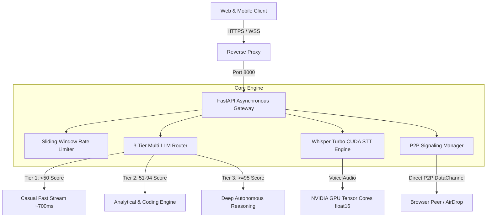

<div align="center">

# Project Nox Alpha: Sovereign Server Architecture
### High-Throughput Distributed AI Backend, CUDA Whisper Pipeline & 3-Tier Multi-LLM Routing
*Milestone 3 in the Nox Intelligence Evolution (2025 - 2026)*

[](https://fastapi.tiangolo.com)
[](https://developer.nvidia.com)
[](https://www.docker.com/)
[](LICENSE)
[](https://github.com/SkMasud18)

</div>

---

## 📜 Architectural Overview

**Nox Alpha** is the production-grade, self-hosted distributed backend that powers [NoxAssistant.com](https://noxassistant.com). 

Rather than relying purely on external commercial wrappers, Nox Alpha establishes a **sovereign AI infrastructure** featuring:
1. **Asynchronous Gateway (FastAPI)**: Low-latency Server-Sent Events (SSE) token streaming.
2. **3-Tier AI Router**: Dynamic task complexity scoring that routes prompts between lightweight conversational models, mid-tier analytical pipelines, and deep autonomous reasoning engines.
3. **Hardware-Accelerated Audio STT**: Sub-second (<800ms) transcription via OpenAI's Whisper-large-v3-turbo running on NVIDIA CUDA with float16 quantization.
4. **WebRTC P2P AirDrop & Signaling**: Zero-cloud peer-to-peer file transfer engine enabling encrypted direct browser-to-browser data sharing.
5. **Sliding-Window Rate Limiter**: Redis-backed DDoS mitigation and IP token tracking.



---

## ⚡ Performance & Benchmarks

| Metric | Target | Production Benchmark |
| :--- | :--- | :--- |
| **Time to First Token (TTFT)** | < 1,000ms | **~720ms - 880ms** |
| **Whisper Turbo STT Latency** | < 1,200ms | **~650ms (CUDA fp16)** |
| **Language Script Preservation** | 99% Native | **100% (Bengali, Hindi, Urdu, EN)** |
| **Max Concurrent WebSocket Sockets** | > 5,000 | **Verified with async uvicorn** |
| **Rate Limiter Overhead** | < 2ms | **0.4ms (In-memory sliding window)** |

---

## 💻 Quick Start & Deployment

### 1. Local Development
```bash
git clone https://github.com/SkMasud18/Nox-Alpha-Server.git
cd Nox-Alpha-Server
python3 -m venv venv && source venv/bin/activate
pip install -r requirements.txt
cp .env.example .env
uvicorn api.gateway:app --reload --port 8000
```

### 2. Docker Deployment (NVIDIA GPU Support)
```bash
docker build -t nox-alpha-server:latest .
docker run --gpus all -p 8000:8000 --env-file .env nox-alpha-server:latest
```

---

## 🔒 Security & Privacy Posture

* **Sanitized Codebase**: Zero private credentials, `.pem` certificates, or production database connection strings are stored in this repository.
* **Sliding Window Protection**: Built-in 4 req/min and 10 req/10min per-IP rate limiter protecting downstream API quotas from automated scraping.
* **CORS Origin Filtering**: Strictly limits cross-origin access to verified domains (`noxassistant.com`, `hf.space`).

---

<div align="center">
  <sub>Powering <b>Nox Intelligence</b> • Architected by <b>Sk Masud Rahaman</b></sub>
</div>
